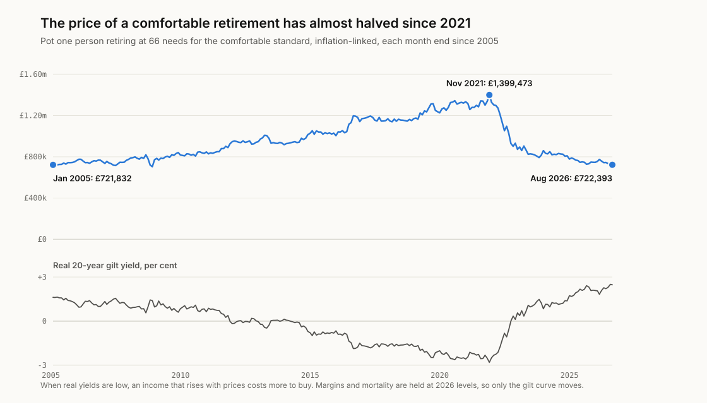
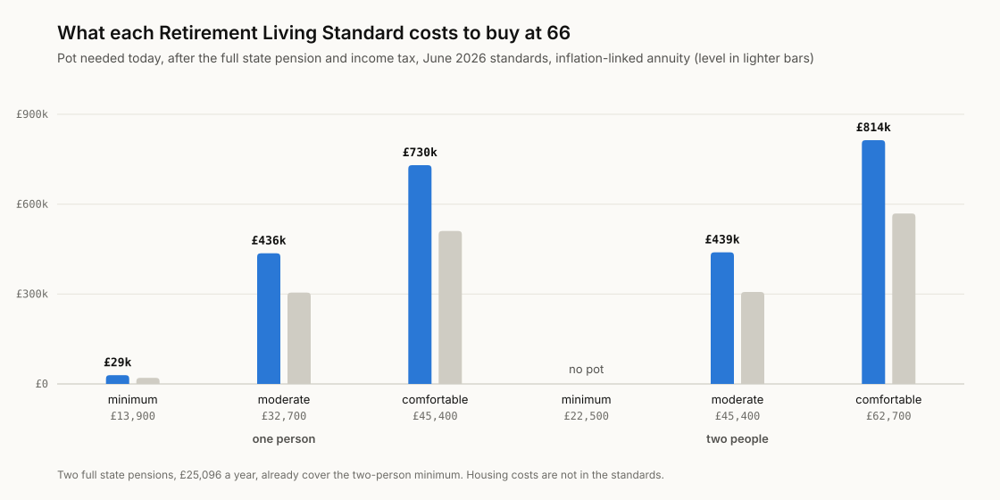
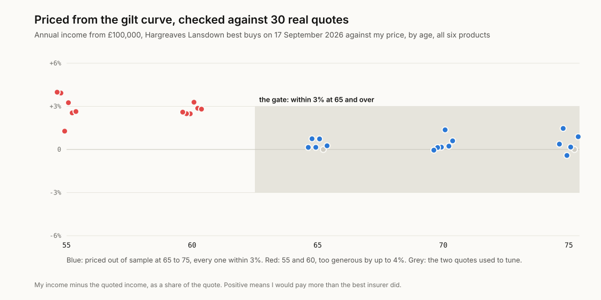

# pension-pot

What a retirement costs to buy. The pension pot each Retirement Living
Standard needs, once the state pension and tax are counted, priced from the
Bank of England's gilt curves and the ONS's mortality projections, and checked
against 30 annuity quotes insurers were actually offering.

**Work out yours:** [finntech3.github.io/pension-pot](https://finntech3.github.io/pension-pot/)

**Why I built this.** Everyone repeats some version of "you need a million
pounds to retire" as though it were a law of physics rather than a number
that came from somewhere specific. It came from an annuity rate, which
moves a great deal more than anyone quoting the number lets on.

## The finding

**The price of a comfortable retirement has almost halved since 2021.** In
November 2021, one person retiring at 66 needed a pot of £1,399,473 to buy the
comfortable standard for life with an income that rises with prices. At the
end of August 2026 the same retirement cost £722,393. Nothing about the
retirement changed: the same standard, the same state pension, the same tax,
today's insurer margins throughout. Only gilt yields moved. The real 20-year
gilt yield went from -2.81% to +2.47%.

<picture>
  <source media="(prefers-color-scheme: dark)" srcset="docs/figures/history-dark.svg">
  
</picture>

It is back almost exactly where it was in January 2005 (£721,832). The years in
between, when yields were falling, made retirement steadily more expensive to
buy, and 2022 undid them in months.

**What I think this means.** "You need a million pounds to retire" is not a
fixed truth about retirement. It is an income divided by an annuity rate, and
the annuity rate is the half of that sum nobody quotes, mostly because it
makes for a worse headline than a big round number does. Anyone who worked
out their number in 2021 and has not redone it is aiming at a target nearly
twice too high, and anyone who did the sum in 2005 happens to be about right
again, purely by accident of when interest rates decided to move.

## What each standard costs today

The Retirement Living Standards (Pensions UK and Loughborough University, June
2026) are yearly spending after tax, excluding housing. With the full state
pension of £12,548 a year each and 2026-27 income tax, buying at 66 on 17
September 2026:

| Standard | Spending a year | Pot, income rising with prices | Pot, level income |
|---|---:|---:|---:|
| One person, minimum | £13,900 | £29,163 | £20,391 |
| One person, moderate | £32,700 | £436,009 | £304,856 |
| One person, comfortable | £45,400 | £730,107 | £510,488 |
| Two people, minimum | £22,500 | none: two state pensions cover it | none |
| Two people, moderate | £45,400 | £439,203 | £307,089 |
| Two people, comfortable | £62,700 | £813,588 | £568,858 |

<picture>
  <source media="(prefers-color-scheme: dark)" srcset="docs/figures/pots-dark.svg">
  
</picture>

Two things stand out. The state pension alone nearly covers the one-person
minimum, and two of them cover the two-person minimum outright. And a couple
needs barely more than a single person for a moderate retirement, £439,203
against £436,009, because they have two state pensions and two tax
allowances.

At today's prices £100,000 buys £5,776 a year rising with prices at 66, or
£8,261 fixed in pounds. A level income is cheaper to buy because it is worth
less: at 2% inflation it loses a third of its buying power in twenty years.

## Verify before you interpret

Every annuity here is priced from first principles. Its cost is the sum, over
every future month, of the chance the buyer is alive then times what £1 then
costs today on the gilt curve, plus a margin. Two numbers are not in public
data and are tuned to two real quotes: the insurer's margin over gilts (0.60
points) and how much lighter annuity buyers' mortality is than the population's
(60% of the ONS rates).

Then the model is checked against every quote in Hargreaves Lansdown's
best-buy table for 17 September 2026: six products (level, with and without a
five-year guarantee; inflation-linked; 3% escalating; joint life level and
escalating) at ages 55, 60, 65, 70 and 75.

| | Quotes | Result |
|---|---:|---|
| Used to tune | 2 | level, 65 and 75 |
| Priced blind, 65 to 75 | 16 | every one within 3%, worst 1.5% |
| Priced blind, 55 and 60 | 12 | all too generous, by 1.3% to 4.0%; four beyond 3% |

<picture>
  <source media="(prefers-color-scheme: dark)" srcset="docs/figures/quotes-dark.svg">
  
</picture>

The gate is the ages this project uses, 65 and over, and every quote there
passes. Below 65 the model is consistently too generous, and I say so rather
than hide it: a test pins that bias, and the tool only prices from 65. One
possible reason is that insurers charge more for the longer payouts of younger
buyers, which a single flat margin cannot capture.

Two twin tests show the check can fail. Pricing with the ONS population's
mortality instead of annuity buyers' passes only 7 of the 17 quotes at 65 and
over, worst gap 9.4%. Pricing the inflation-linked annuities off the nominal
curve instead of the real one misses them by as much as 62%.

## How it works

- **The curves.** The Bank of England's nominal and real zero-coupon gilt
  curves for 17 September 2026, and the real curve at every month end since
  2005 for the history. Yields are continuously compounded; the real curve
  prices income that rises with RPI.
- **Who is alive.** The ONS's 2024-based projected death rates for the UK,
  followed along each buyer's own cohort, men and women averaged because
  annuities are priced the same for both by law, scaled to annuity buyers.
- **The income.** Paid monthly in advance, for life; a guarantee pays for its
  first years regardless; a joint life pays half to a spouse three years
  younger; escalating income rises 3% each year.
- **The pot.** The annuity income needed before tax is whatever, with the
  state pension, leaves the standard's spending after 2026-27 income tax. A
  couple is two people each with a state pension, an allowance and half the
  standard. The pot is that income divided by the annuity rate.

More on each choice in [docs/DESIGN-DECISIONS.md](docs/DESIGN-DECISIONS.md).
Every source, address and checksum is in [docs/SOURCES.md](docs/SOURCES.md).

## What this leaves out

- **Drawdown.** Most people now keep their pot invested and draw an income.
  That has no single price, only probabilities, so it is not modelled. An
  annuity's price is the certain cost of an income for life, which is what
  makes one year comparable with another.
- **Past margins.** The history holds today's margin and mortality fixed, so
  it shows what gilt yields did, not what insurers would have quoted.
- **Health.** Buyers in poor health, or who smoke, can get enhanced rates and
  need smaller pots.
- **Housing.** The standards exclude rent and mortgage payments.
- **The survivor.** In the couple case, the one left after a death keeps their
  own annuity and state pension, which is less than the one-person standard.
- **Scotland and London.** Tax is at rates for the rest of the UK, and the 2026
  standards publish no London figures.

## What I got wrong first

- **I pitched the story backwards.** My first idea was "the £600,000 you think
  you need is really £1.3m". £1.3m was the 2021 price; it has almost halved
  since.
- **I used last year's standards.** The Retirement Living Standards were
  updated on 3 June 2026 and I had built everything on the 2025 figures.
  Every pot here moved when I caught it; the comfortable one from £687,000 to
  £730,107.
- **The first check was too easy to pass.** It tested four quotes, typed from
  the page through a summarising tool. Reading the raw page again gave 30, and
  the wider check found the bias below 65 that four quotes had missed.
- **I claimed something I had not checked.** An early draft said that today's
  margins made the 2021 prices, if anything, too low. I could not find past
  quotes to show it, so the claim is gone.
- **I planned a second check that could not exist.** I meant to reproduce
  the pot sizes in the Pensions Policy Institute's technical report for the
  standards. The report does not publish them.

## Running it

Python 3.11 or later, standard library only.

```sh
python -m pip install pytest
PYTHONPATH=pipeline/src python -m pensionpot.report    # every number above
python -m pytest pipeline/tests                        # checks, twins, tax and pots
python scripts/make_figures.py                         # redraw docs/figures
PYTHONPATH=pipeline/src python -m pensionpot.build     # the app's data
```

The app, in `web/`, needs Node 22:

```sh
cd web
npm ci
npm test
npm run dev
```

## License

MIT for the code. Bank of England and ONS data are used under the Open
Government Licence v3.0. The Retirement Living Standards and Hargreaves
Lansdown's rates are quoted as published.
